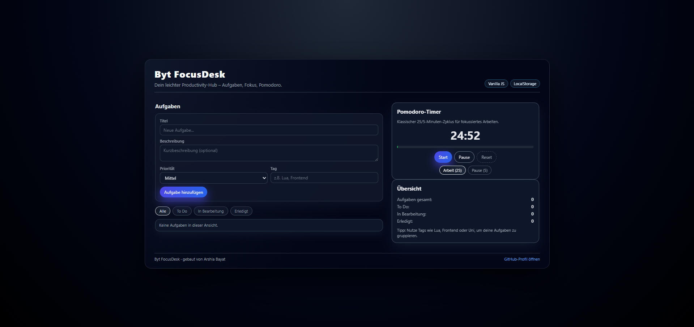

# Byt FocusDesk

Ein leichtgewichtiges Productivity-Dashboard zum Verwalten von Aufgaben
und fokussiertem Arbeiten -- entwickelt mit **Vanilla JavaScript**, HTML
und CSS.



------------------------------------------------------------------------

## Features

-   ✅ Aufgabenverwaltung mit Status:
    -   **To Do**
    -   **In Bearbeitung**
    -   **Erledigt**
-   🎯 Prioritäten (Niedrig / Mittel / Hoch)
-   🏷️ Tags (z. B. `Lua`, `Frontend`, `Uni`)
-   💾 Persistenz über `localStorage` -- Aufgaben bleiben nach dem
    Neuladen erhalten
-   ⏱️ Integrierter **Pomodoro-Timer** (25/5 Minuten) mit
    Fortschrittsbalken
-   📱 Responsives Layout, optimiert für Desktop

------------------------------------------------------------------------

## Tech Stack

-   **HTML5** -- Grundstruktur
-   **CSS3** -- Layout, Animationen, Hover-States, „Glassmorphism"-Style
-   **JavaScript (ES6+)** -- State-Management, Rendering, Timer-Logik,
    `localStorage`

------------------------------------------------------------------------

## Projektstruktur

``` text
.
├─ index.html   # Einstiegspunkt, Layout der App
├─ styles.css   # Styles (Layout, Farben, Animations)
├─ app.js       # Anwendungslogik (Tasks + Timer)
└─ assets/
   └─ focusdesk-preview.png  # Screenshot für README / Social Preview
```

------------------------------------------------------------------------

## Installation & Nutzung

1.  Repository klonen oder als ZIP herunterladen:

    ``` bash
    git clone https://github.com/ArshiaByt/byt-focusdesk.git
    cd byt-focusdesk
    ```

2.  `index.html` im Browser öffnen (Doppelklick reicht).

3.  Aufgaben über das Formular anlegen, Status per Dropdown ändern.

4.  Pomodoro-Timer starten und fokussiert arbeiten.

Es wird kein Build-Tool und kein Backend benötigt.

------------------------------------------------------------------------

## Technische Entscheidungen

-   **Vanilla JavaScript statt Framework**\
    Um zu zeigen, dass Logik, State-Handling und DOM-Manipulation auch
    ohne Framework von Grund auf verstanden werden.
-   **`localStorage` für Persistenz**\
    Einfacher, browserbasierter Speicher -- ideal für ein
    Single-User-Tool ohne Backend.
-   **Getrennte Dateien** (`index.html`, `styles.css`, `app.js`)\
    Klare Trennung von Struktur, Darstellung und Logik, um Wartbarkeit
    zu erhöhen.

------------------------------------------------------------------------

## Mögliche Erweiterungen

-   Filter nach Tag / Suche in Aufgaben
-   Export/Import der Aufgaben als JSON
-   Dark-/Light-Mode Toggle
-   Backend-API (z. B. Node.js/Express) für Multi-User-Support
-   User-Accounts mit Login

------------------------------------------------------------------------

## Autor

**Arshia Bayat**\
Angehender Fachinformatiker für Anwendungsentwicklung

-   GitHub: [github.com/ArshiaByt](https://github.com/ArshiaByt)
-   Projekt: [Byt FocusDesk](https://github.com/ArshiaByt/byt-focusdesk)
